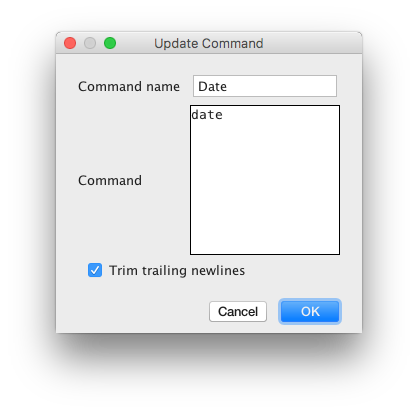

#  Shell Filter

## Introduction

The Shell Filter plugin for Jetbrains IDEs enables the developer to run
an external shell command and insert or replace the returned output
into the current Editor.

It is an adoption and rebrush of the old [Shell Process](https://plugins.jetbrains.com/plugin/6001-shell-process)-plugin by Morgan Schweers.

## Configuration

Shell Filter can be configured in the global IDE settings.

### Shell command

The command to run by the Shell Filter action will be saved into a temporary
file in the operating system's file system.

The Shell command will be run by Shell Filter with this temporary file.

The setting can include a "%s", that will be replaced with the path to the
temporary file. If it's missing, the path will be simply appended to the
shell command.

### Commands

You can configure all commands, that you want to run using Shell Filter.

Each command contains three settings:

* Command name: used when selecting the commands
* Command: The command to run. Can be a simple one line command or a
  complete script
* Trim leading newlines from command output: Usually, a command output ends with
  a newline. If this is selected, any whitespace characters and newlines will
  be removed from the output before inserting the text into the editor.

*Please note*: If text was selected in the editor, it is provided to the
command via the STDIN pipe.

## Usage

To use Shell Filter, just select the Shell Filter action from either the
command palette or the "Edit" menu. Afterwards, select the command to
run.

It's also possible to run a custom command, that was not configured in the
preferences before. Just select "Custom" and enter the command to run.

The custom command is saved for later use.

If you have selected text, it will be replaced with the output of the
command. If not, the output will be inserted at the current caret position.
